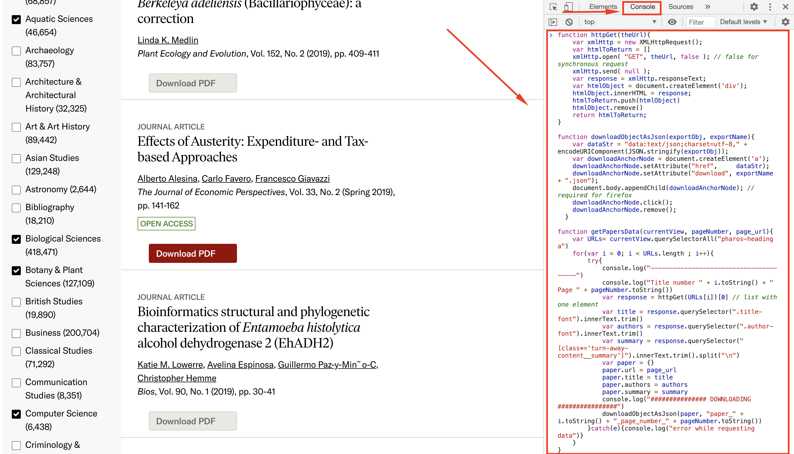
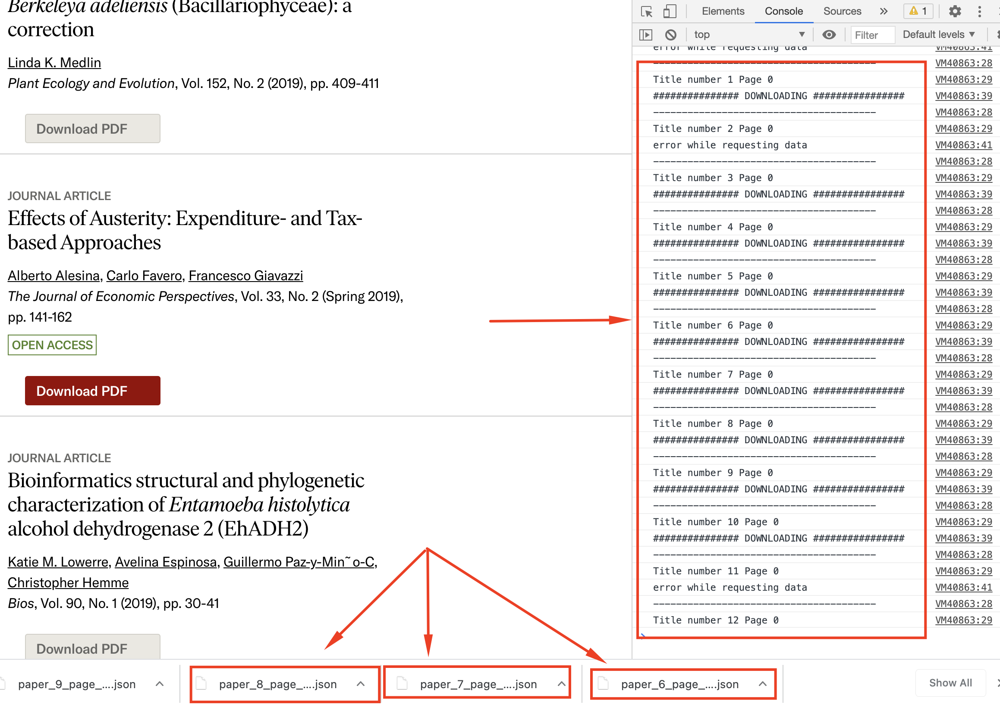

# jstor_papers_scrapping
get titles, authors, and summaries from several papers from https://www.jstor.org/ site

How to use it
-------------
1) Go to https://www.jstor.org/
2) Perform any search between two dates
3) Open your Google Developer Console
4) Paste the code from papers_scrapping.js and hit ENTER
6) An automatic multiple papers download in JSON format will start

Note: jstor has a max deep of 100 paginations

